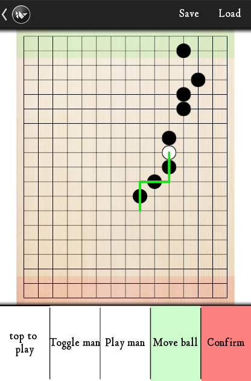

Phutball
########

Phutball (also known as Philosopher's Football) is a two-player strategy board game. It is known for its fairly simple rules, but complex tactics.

This repository holds a simple Kivy implementation of a Phutball board.

